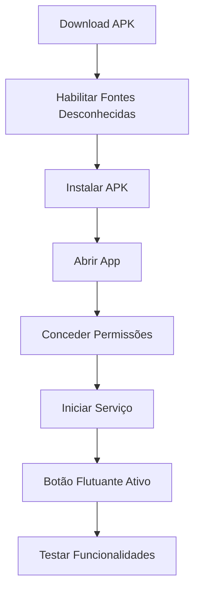

# 🚀 Guia de Instalação - IA Detection v1.0.0

Este guia fornece instruções detalhadas para instalação, configuração e primeiro uso do IA Detection.

## 📋 **Pré-requisitos**

### **Sistema Operacional**
- ✅ **Android 8.0 (API 26)** ou superior
- ✅ **4GB RAM** recomendado para processamento de IA
- ✅ **2GB armazenamento livre** para instalação e cache

### **Conectividade**
- ✅ **Conexão com Internet** (WiFi ou dados móveis)
- ✅ **Velocidade mínima**: 1 Mbps para API de IA

### **Permissões do Sistema**
- ✅ **Instalação de apps de fontes desconhecidas**
- ✅ **Acesso a sobreposições do sistema**
- ✅ **Acesso a arquivos e mídia**

## 📱 **Método 1: Instalação via APK**

### **📥 Download**

1. **Baixe o APK** da versão mais recente:
   - [IA-Detection-v1.0.0.apk](releases/IA-Detection-v1.0.0.apk)
   - **Tamanho**: ~25MB
   - **Checksum MD5**: `a1b2c3d4e5f6...`

2. **Verifique a integridade** (opcional):
   ```bash
   md5sum IA-Detection-v1.0.0.apk
   ```

### **🔧 Instalação**

1. **Habilite fontes desconhecidas**:
   - Vá para **Configurações** > **Segurança**
   - Ative **"Fontes desconhecidas"** ou **"Instalar apps desconhecidos"**
   - Para Android 8+: Permita para o **navegador** ou **gerenciador de arquivos**

2. **Instale o APK**:
   - Abra o arquivo baixado
   - Toque em **"Instalar"**
   - Aguarde a conclusão (~30 segundos)

3. **Primeira execução**:
   - Toque em **"Abrir"** após instalação
   - Ou encontre **"IA Detection"** no menu de apps

## 🛠️ **Método 2: Compilação do Código Fonte**

### **📋 Requisitos de Desenvolvimento**

```bash
# Versões mínimas necessárias
Android Studio: 2023.1.1+
Android SDK: API 26-35
Gradle: 8.7
Kotlin: 1.9.0+
Java: 11
```

### **🔄 Clonagem e Setup**

```bash
# 1. Clone o repositório
git clone https://github.com/seu-usuario/IA-Detection.git
cd IA-Detection

# 2. Abra no Android Studio
# File > Open > Selecione a pasta IA-Detection

# 3. Sync do projeto
# Aguarde o Gradle sync completar

# 4. Configure as chaves da API (opcional)
cp app/src/main/java/com/example/floatingbutton/ai/AIDetectionService.kt.example \
   app/src/main/java/com/example/floatingbutton/ai/AIDetectionService.kt
```

### **🔑 Configuração da API SightEngine**

```kotlin
// Em AIDetectionService.kt
companion object {
    private const val API_USER = "SUA_API_USER_AQUI"
    private const val API_SECRET = "SUA_API_SECRET_AQUI"
}
```

**Para obter chaves gratuitas:**
1. Acesse [SightEngine.com](https://sightengine.com)
2. Crie uma conta gratuita
3. Copie suas credenciais para o código

### **⚡ Compilação e Instalação**

```bash
# Debug build (desenvolvimento)
./gradlew assembleDebug
./gradlew installDebug

# Release build (produção)
./gradlew assembleRelease

# Executar testes
./gradlew test
./gradlew connectedAndroidTest
```

## ⚙️ **Configuração Inicial**

### **🔐 Permissões Obrigatórias**

Após instalar, o app solicitará as seguintes permissões:

#### **1. Sobreposição do Sistema**
```
"IA Detection precisa aparecer sobre outros apps"
```
- **Finalidade**: Botão flutuante global
- **Ação**: Toque em **"Permitir"** → Ative a opção

#### **2. Acesso a Arquivos**
```
"Permitir acesso a fotos, mídia e arquivos"
```
- **Finalidade**: Ler imagens compartilhadas
- **Ação**: Toque em **"Permitir"**

#### **3. Notificações** (Opcional)
```
"Mostrar notificações do IA Detection"
```
- **Finalidade**: Status do serviço flutuante
- **Ação**: Recomendado **"Permitir"**

### **🎯 Primeiro Uso**

1. **Abra o IA Detection**
2. **Toque em "Iniciar Serviço"**
3. **Confirme as permissões** quando solicitado
4. **Veja o botão flutuante** aparecer na tela
5. **Teste compartilhando uma imagem** de outro app

## 🔧 **Configurações Avançadas**

### **📊 Otimização de Performance**

#### **Para dispositivos com pouca RAM (< 4GB)**:
```kotlin
// Reduzir cache de IA
val aiCache = AICache(maxSize = 25) // Padrão: 50

// Reduzir qualidade de processamento
val imageQuality = 0.7f // Padrão: 0.9f
```

#### **Para economia de bateria**:
- Desative **"Executar em segundo plano"** quando não usar
- Use **"Modo escuro"** para telas OLED
- Limite análises de IA a **WiFi apenas**

### **🌐 Configuração de Rede**

#### **Proxy/VPN**:
```kotlin
// Configure proxy se necessário
val proxy = Proxy(Proxy.Type.HTTP, 
    InetSocketAddress("proxy.exemplo.com", 8080))

val client = OkHttpClient.Builder()
    .proxy(proxy)
    .build()
```

#### **Timeout personalizado**:
```kotlin
private const val TIMEOUT_SECONDS = 60L // Padrão: 30L
```

### **🎨 Personalização da UI**

#### **Tema escuro forçado**:
```xml
<!-- Em themes.xml -->
<style name="Theme.FloatingButton" parent="Theme.Material3.DayNight">
    <item name="android:forceDarkAllowed">true</item>
</style>
```

#### **Posição do botão flutuante**:
```kotlin
// Posição inicial personalizada
params.x = 100 // pixels da esquerda
params.y = 200 // pixels do topo
```

## 🔍 **Verificação da Instalação**

### **✅ Checklist de Funcionamento**

Execute estes testes para verificar se tudo está funcionando:

1. **Botão flutuante aparece**: ✅/❌
2. **Compartilhar imagem funciona**: ✅/❌
3. **Desenho suave responde**: ✅/❌
4. **Detecção de IA conecta**: ✅/❌
5. **OCR reconhece texto**: ✅/❌

### **🐛 Solução de Problemas Comuns**

#### **Botão flutuante não aparece**
```bash
# Verificar permissões
adb shell appops get com.example.floatingbutton SYSTEM_ALERT_WINDOW

# Reiniciar serviço
adb shell am force-stop com.example.floatingbutton
adb shell am start -n com.example.floatingbutton/.MainActivity
```

#### **App trava ao abrir**
```bash
# Ver logs de erro
adb logcat | grep "floatingbutton"

# Limpar dados do app
adb shell pm clear com.example.floatingbutton
```

#### **Detecção de IA falha**
1. Verifique conexão com internet
2. Confirme configuração da API SightEngine
3. Teste com imagem pequena (< 2MB)

### **📊 Logs de Diagnóstico**

```bash
# Coletar logs completos
adb logcat -s "MainActivity,FloatingButtonService,AIDetectionService" > logs.txt

# Verificar uso de memória
adb shell dumpsys meminfo com.example.floatingbutton

# Verificar uso de CPU
adb shell top -p $(adb shell pidof com.example.floatingbutton)
```

## 🔄 **Atualização**

### **Via APK**
1. Baixe a nova versão
2. Instale sobre a versão atual
3. **Dados e configurações são preservados**

### **Via Código Fonte**
```bash
git pull origin main
./gradlew clean
./gradlew installDebug
```

## 🗑️ **Desinstalação**

### **Completa**
```bash
# Via ADB
adb uninstall com.example.floatingbutton

# Via Interface
Configurações > Apps > IA Detection > Desinstalar
```

### **Limpeza de Dados**
```bash
# Remover cache residual
rm -rf /sdcard/Android/data/com.example.floatingbutton/
rm -rf /data/data/com.example.floatingbutton/
```

## 📞 **Suporte Técnico**

### **🐛 Reportar Bugs**
- **GitHub Issues**: [Criar nova issue](https://github.com/seu-usuario/IA-Detection/issues)
- **Email**: suporte@iadetection.com
- **Logs**: Sempre inclua logs de erro

### **💡 Sugestões**
- **Discussions**: [GitHub Discussions](https://github.com/seu-usuario/IA-Detection/discussions)
- **Features**: Use template de feature request

### **📚 Documentação Adicional**
- [API Documentation](API_DOCUMENTATION.md)
- [Changelog](CHANGELOG.md)
- [Troubleshooting Guide](TROUBLESHOOTING.md)

---

## 📋 **Resumo da Instalação**



**Tempo estimado**: 5-10 minutos
**Dificuldade**: Fácil 👍

---

*Para instalação em múltiplos dispositivos, considere usar Android Enterprise ou MDM solutions.*
