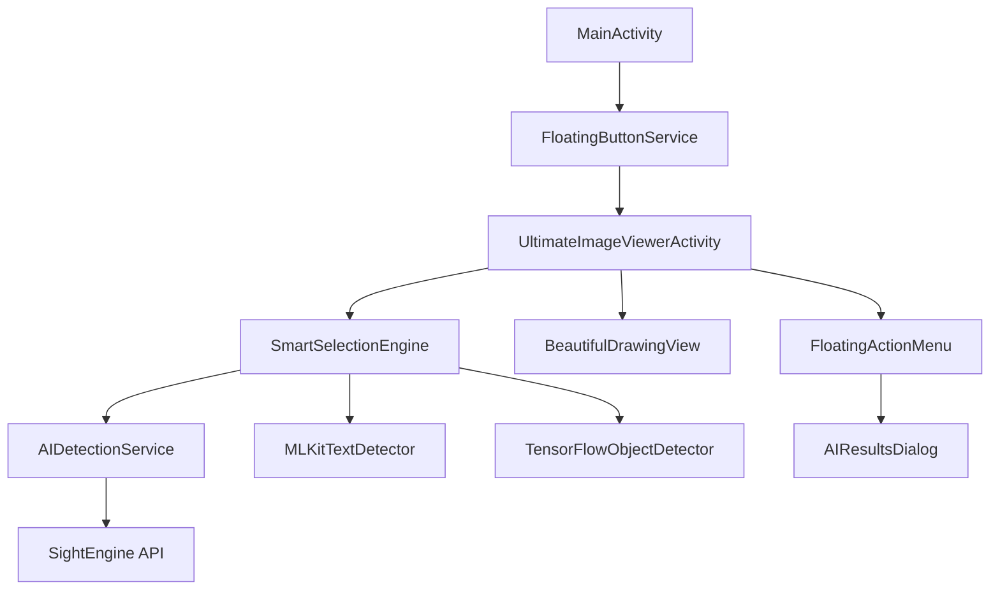

# 🏗️ Estrutura do Projeto - IA Detection v1.0.0

Esta documentação detalha a organização completa do projeto IA Detection.

## 📂 **Visão Geral da Estrutura**

```
📱 IA-Detection/
├── 📋 Documentação
│   ├── README_v1.md                    # README principal
│   ├── CHANGELOG.md                    # Histórico de versões
│   ├── API_DOCUMENTATION.md            # Documentação técnica
│   ├── INSTALLATION_GUIDE.md           # Guia de instalação
│   └── PROJECT_STRUCTURE.md            # Este arquivo
│
├── 🔧 Configuração do Projeto
│   ├── build.gradle                    # Configuração global
│   ├── settings.gradle                 # Módulos do projeto
│   ├── gradle.properties               # Propriedades do Gradle
│   ├── local.properties                # Configurações locais
│   └── gradle/
│       └── wrapper/
│           └── gradle-wrapper.properties
│
├── 📱 Módulo Principal (app/)
│   ├── build.gradle                    # Dependencies e configuração
│   ├── proguard-rules.pro             # Regras de ofuscação
│   └── src/main/
│       ├── AndroidManifest.xml        # Configuração do app
│       ├── assets/                    # Recursos estáticos
│       ├── res/                       # Recursos Android
│       └── java/com/example/floatingbutton/
│
└── 📚 Documentação Histórica
    ├── CAPTURA_TELA_README.md         # Docs de desenvolvimento
    ├── CORREÇÃO_*.md                  # Histórico de correções
    └── DEBUG_LOGS.md                  # Logs de debug
```

## 🎯 **Módulo Principal (app/)**

### **📂 Estrutura de Código Fonte**

```
app/src/main/java/com/example/floatingbutton/
│
├── 🎯 Activities Principais
│   ├── MainActivity.kt                 # Ponto de entrada do app
│   ├── UltimateImageViewerActivity.kt  # Visualizador principal
│   ├── ModernImageViewerActivity.kt    # Versão intermediária
│   ├── ImageViewerActivity.kt          # Versão legacy
│   └── ScreenCaptureActivity.kt        # Captura de tela
│
├── 🔵 Serviços do Sistema
│   └── FloatingButtonService.kt        # Serviço do botão flutuante
│
├── 🤖 Módulo de Inteligência Artificial
│   ├── AIDetectionService.kt           # API SightEngine
│   ├── SmartSelectionEngine.kt         # Orquestrador de IA
│   │
│   ├── 📝 ML Kit Integration
│   │   └── mlkit/
│   │       └── MLKitTextDetector.kt    # OCR com Google ML Kit
│   │
│   ├── 🧠 TensorFlow Integration
│   │   └── tensorflow/
│   │       └── TensorFlowObjectDetector.kt # Detecção de objetos
│   │
│   ├── 🔧 Processamento Nativo
│   │   └── opencv/
│   │       └── OpenCVObjectDetector.kt # Algoritmos nativos
│   │
│   ├── 🎨 Segmentação Semântica
│   │   └── semantic/
│   │       └── SemanticSegmentationEngine.kt
│   │
│   └── 💾 Sistema de Cache
│       └── cache/
│           └── AICache.kt              # Cache LRU otimizado
│
├── 🎨 Componentes de Interface
│   ├── ui/
│   │   ├── BeautifulDrawingView.kt     # Desenho suave
│   │   ├── FloatingActionMenu.kt       # Menu flutuante
│   │   ├── AIResultsDialog.kt          # Diálogo de resultados
│   │   ├── LiveOCROverlay.kt           # OCR em tempo real
│   │   └── SmartRectangleDrawingView.kt # Formas inteligentes
│   │
│   └── 📋 Views Legacy (Compatibilidade)
│       ├── FreeDrawCropView.kt         # Desenho livre
│       └── CircularCropView.kt         # Recorte circular
```

### **📱 Recursos Android (res/)**

```
app/src/main/res/
│
├── 🎨 Drawables
│   ├── circular_button_background.xml  # Botão circular
│   ├── ic_floating_button.xml          # Ícone do botão
│   ├── ic_launcher_background.xml      # Background do launcher
│   ├── ic_launcher_foreground.xml      # Foreground do launcher
│   └── menu_background.xml             # Background do menu
│
├── 📱 Layouts
│   ├── activity_main.xml               # Layout principal
│   ├── activity_image_viewer.xml       # Visualizador de imagem
│   └── floating_action_menu.xml        # Menu flutuante
│
├── 🖼️ Ícones (Múltiplas Densidades)
│   ├── mipmap-anydpi-v26/
│   │   ├── ic_launcher.xml             # Ícone adaptativo
│   │   └── ic_launcher_round.xml       # Ícone redondo
│   ├── mipmap-hdpi/
│   ├── mipmap-mdpi/
│   ├── mipmap-xhdpi/
│   ├── mipmap-xxhdpi/
│   └── mipmap-xxxhdpi/
│
├── 🎨 Valores
│   ├── colors.xml                      # Cores do tema
│   ├── strings.xml                     # Textos do app
│   └── themes.xml                      # Temas Material
│
└── 🔧 Configurações XML
    ├── backup_rules.xml                # Regras de backup
    ├── data_extraction_rules.xml       # Extração de dados
    └── file_provider_paths.xml         # Caminhos do FileProvider
```

### **📚 Assets**

```
app/src/main/assets/
├── 🧠 Modelos de IA
│   ├── mobilenet_v1_1.0_224_quant.tflite  # TensorFlow Lite model
│   ├── labels.txt                          # Labels para classificação
│   └── [outros modelos conforme necessário]
│
└── 📄 Dados Estáticos
    └── [arquivos de configuração]
```

## 🔧 **Configurações do Projeto**

### **build.gradle (Project)**

```gradle
buildscript {
    ext.kotlin_version = "1.9.0"
    dependencies {
        classpath "com.android.tools.build:gradle:8.7.0"
        classpath "org.jetbrains.kotlin:kotlin-gradle-plugin:$kotlin_version"
    }
}

allprojects {
    repositories {
        google()
        mavenCentral()
    }
}
```

### **build.gradle (Module: app)**

```gradle
android {
    namespace 'com.example.floatingbutton'
    compileSdk 35
    
    defaultConfig {
        applicationId "com.example.floatingbutton"
        minSdk 26
        targetSdk 35
        versionCode 1
        versionName "1.0.0"
    }
    
    compileOptions {
        sourceCompatibility JavaVersion.VERSION_11
        targetCompatibility JavaVersion.VERSION_11
    }
    
    kotlinOptions {
        jvmTarget = '11'
    }
}

dependencies {
    // 📱 Android Core
    implementation 'androidx.core:core-ktx:1.12.0'
    implementation 'androidx.appcompat:appcompat:1.6.1'
    implementation 'com.google.android.material:material:1.11.0'
    
    // 🤖 AI Libraries
    implementation 'org.tensorflow:tensorflow-lite:2.14.0'
    implementation 'com.google.mlkit:text-recognition:16.0.0'
    implementation 'com.google.mlkit:object-detection:17.0.1'
    
    // 🌐 Network
    implementation 'com.squareup.okhttp3:okhttp:4.12.0'
    implementation 'org.json:json:20231013'
}
```

### **AndroidManifest.xml**

```xml
<manifest xmlns:android="http://schemas.android.com/apk/res/android">
    
    <!-- 🔐 Permissões Críticas -->
    <uses-permission android:name="android.permission.SYSTEM_ALERT_WINDOW" />
    <uses-permission android:name="android.permission.FOREGROUND_SERVICE" />
    <uses-permission android:name="android.permission.FOREGROUND_SERVICE_MEDIA_PROJECTION" />
    <uses-permission android:name="android.permission.INTERNET" />
    <uses-permission android:name="android.permission.READ_EXTERNAL_STORAGE" />
    
    <application
        android:icon="@mipmap/ic_launcher"
        android:label="@string/app_name"
        android:theme="@style/Theme.FloatingButton">
        
        <!-- 🎯 Activity Principal -->
        <activity android:name=".MainActivity" android:exported="true">
            <intent-filter>
                <action android:name="android.intent.action.MAIN" />
                <category android:name="android.intent.category.LAUNCHER" />
            </intent-filter>
            <!-- 📤 Share Intent -->
            <intent-filter>
                <action android:name="android.intent.action.SEND" />
                <category android:name="android.intent.category.DEFAULT" />
                <data android:mimeType="image/*" />
            </intent-filter>
        </activity>
        
        <!-- 🔵 Serviço Flutuante -->
        <service
            android:name=".FloatingButtonService"
            android:foregroundServiceType="mediaProjection" />
            
        <!-- 🖼️ Visualizadores -->
        <activity android:name=".UltimateImageViewerActivity"
                  android:theme="@android:style/Theme.NoTitleBar.Fullscreen" />
                  
        <!-- 📁 FileProvider -->
        <provider
            android:name="androidx.core.content.FileProvider"
            android:authorities="${applicationId}.fileprovider"
            android:grantUriPermissions="true">
            <meta-data android:name="android.support.FILE_PROVIDER_PATHS"
                       android:resource="@xml/file_provider_paths" />
        </provider>
        
    </application>
</manifest>
```

## 📊 **Métricas do Projeto**

### **📈 Estatísticas de Código**

| Categoria | Quantidade | Linhas de Código |
|-----------|------------|------------------|
| **Activities** | 4 | ~1,200 |
| **Services** | 1 | ~300 |
| **AI Classes** | 7 | ~800 |
| **UI Components** | 8 | ~600 |
| **Total Kotlin** | 20+ | ~2,900+ |
| **XML Resources** | 15+ | ~400 |
| **Documentation** | 8 | ~1,500 |

### **📦 Tamanho do APK**

```
📱 APK Final (~25MB)
├── 🤖 Modelos de IA: ~15MB (60%)
├── 📚 Bibliotecas: ~6MB (24%)
├── 🎨 Recursos: ~2MB (8%)
├── 💻 Código: ~1.5MB (6%)
└── 📋 Outros: ~0.5MB (2%)
```

### **🔧 Dependências Principais**

```gradle
// 🤖 Inteligência Artificial (40% do tamanho)
tensorflow-lite: 2.14.0          # ~8MB
mlkit-text-recognition: 16.0.0   # ~4MB
mlkit-object-detection: 17.0.1   # ~3MB

// 📱 Android Framework (30% do tamanho)
androidx.core: 1.12.0            # ~2MB
material: 1.11.0                 # ~3MB
appcompat: 1.6.1                 # ~2MB

// 🌐 Network & Utils (10% do tamanho)
okhttp3: 4.12.0                  # ~1.5MB
json: 20231013                   # ~0.5MB
```

## 🔄 **Fluxo de Dados**



## 🏗️ **Arquitetura em Camadas**

```
┌─────────────────────────────────────────┐
│  🎨 Presentation Layer                  │
│  ├── Activities                        │
│  ├── Custom Views                      │
│  └── Dialogs                          │
├─────────────────────────────────────────┤
│  🧠 Business Logic Layer               │
│  ├── AI Services                       │
│  ├── Smart Selection Engine            │
│  └── Cache Management                  │
├─────────────────────────────────────────┤
│  🔧 System Layer                       │
│  ├── Android Services                  │
│  ├── File Management                   │
│  └── Permission Handling               │
├─────────────────────────────────────────┤
│  🌐 Network Layer                      │
│  ├── HTTP Client                       │
│  ├── API Integration                   │
│  └── Error Handling                    │
└─────────────────────────────────────────┘
```

## 📋 **Padrões de Design Utilizados**

### **🏗️ Architectural Patterns**
- **MVVM**: Model-View-ViewModel
- **Repository**: Para gerenciamento de dados
- **Observer**: Para comunicação entre componentes
- **Singleton**: Para services e cache

### **🔧 Design Patterns**
- **Factory**: Para criação de detectores de IA
- **Strategy**: Para diferentes algoritmos de processamento
- **Command**: Para ações do menu flutuante
- **Composite**: Para componentes de UI complexos

## 🔍 **Pontos de Entrada**

### **📱 Principais Entry Points**

1. **MainActivity.onCreate()**: Inicialização do app
2. **FloatingButtonService.onCreate()**: Serviço flutuante
3. **UltimateImageViewerActivity.handleSharedImage()**: Imagens compartilhadas
4. **SmartSelectionEngine.analyzeRegion()**: Análise de IA

### **🔄 Lifecycle Hooks**

```kotlin
// Activity Lifecycle
onCreate() → onStart() → onResume() → onPause() → onStop() → onDestroy()

// Service Lifecycle  
onCreate() → onStartCommand() → onDestroy()

// Custom View Lifecycle
onAttachedToWindow() → onMeasure() → onLayout() → onDraw() → onDetachedFromWindow()
```

---

## 📚 **Navegação na Documentação**

- **🚀 [Instalação](INSTALLATION_GUIDE.md)**: Como instalar e configurar
- **📋 [Changelog](CHANGELOG.md)**: Histórico de versões
- **🔧 [API Docs](API_DOCUMENTATION.md)**: Documentação técnica
- **📖 [README](README_v1.md)**: Visão geral do projeto

---

*Esta estrutura está organizada para facilitar manutenção, testes e expansão futura do projeto.*
